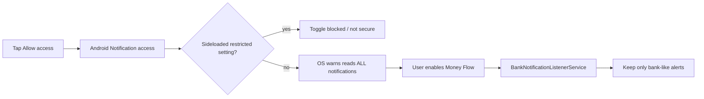
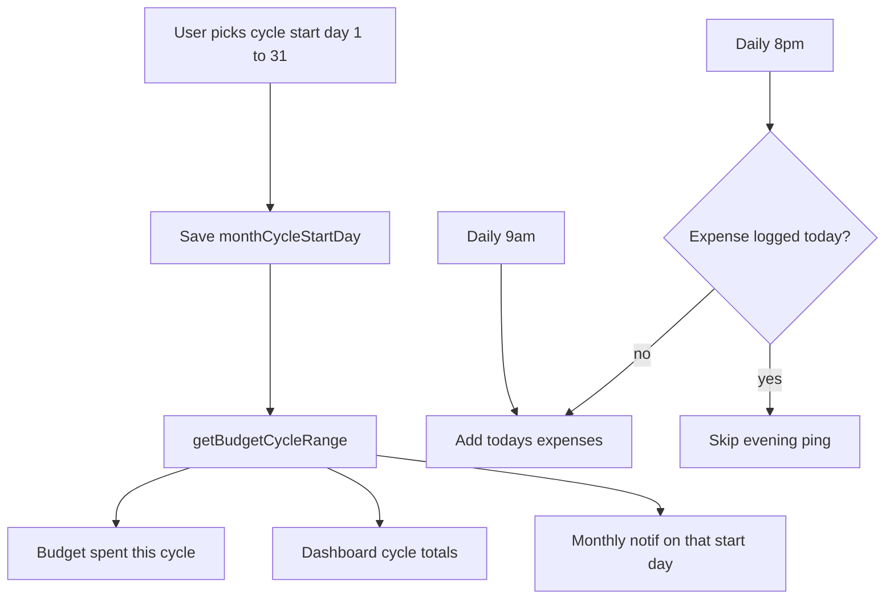

# Fix backup download and notification access

## Direct answers

**1. Backup is not failing because of missing storage access.**

The export screen never writes to device storage. It creates a hidden `<a download>` click, which works in Chrome but **does nothing useful inside Capacitor’s Android WebView**. There is no `WRITE_EXTERNAL_STORAGE` request, and none is required on modern Android if we use the system Share sheet or “Save as” picker.

Evidence:

- [`ExportBackupScreen.tsx`](src/components/ExportBackupScreen.tsx) `handleDownloadJson` / `handleDownloadCsv` use Blob + `<a download>` and toast “exported” even if no file was saved.
- [`downloadHelper.ts`](src/utils/downloadHelper.ts) and [`AutoBackupService.shareOrDownloadBackup`](src/services/autoBackupService.ts) exist, but the backup screen **does not call them**.
- [`package.json`](package.json) has no `@capacitor/filesystem` or `@capacitor/share`.
- [`AndroidManifest.xml`](android/app/src/main/AndroidManifest.xml) already has a `FileProvider` unused for backups.

**2. Yes — the phone’s “not secure” warning is why access cannot be granted. “Banking only” is not an Android permission.**

Tapping Allow correctly opens **Notification listener settings**. Android then warns because this permission can read **every** notification (WhatsApp, OTP, banks). The OS does **not** offer “only banking notifications.”

Our app already filters after the fact in [`BankNotificationListenerService.java`](android/app/src/main/java/com/moneyflow/app/BankNotificationListenerService.java) (`looksLikeBankAlert`), but that filter cannot be applied at the grant screen.

On sideloaded APKs (not Play Store), Android 13+ also blocks this as a **restricted setting**. The toggle can show as blocked / not secure until:

Settings → Apps → Money Flow → ⋮ → **Allow restricted settings** → then enable Notification access.

The listener label `Money Flow bank alerts` in [`strings.xml`](android/app/src/main/res/values/strings.xml) can make OEM security (Play Protect, Samsung Auto Blocker, Xiaomi) treat it like a fake banking app.

Manual paste on the SMS parser screen still works without this permission.

---

## Implementation

### A. Make backup actually land on the phone

Add a small native plugin (same pattern as [`NotificationAccessPlugin.java`](android/app/src/main/java/com/moneyflow/app/NotificationAccessPlugin.java)) instead of new npm packages:

- Write JSON/CSV to app cache.
- Share via `Intent.ACTION_SEND` + existing FileProvider (Drive, WhatsApp, Files).
- Optional `ACTION_CREATE_DOCUMENT` so the user picks Downloads / Drive without storage permission.

Wire [`ExportBackupScreen.tsx`](src/components/ExportBackupScreen.tsx) to this path on Android; keep Blob download for desktop/browser.

Update toasts so success means the share/save sheet opened, not that a fake click ran.

### B. Notification access: unblock + clearer copy (cannot remove OS warning)

Code/UX:

- Rename listener label from `Money Flow bank alerts` to `Money Flow`.
- Before `openSettings()`, show short steps: Restricted settings (if toggle is greyed) → enable Money Flow → Android will warn it can read all notifications; that is normal; we only parse debit/credit/UPI text on-device.
- After resume, if still disabled, show that hint instead of a silent fail.

We **cannot** make Android grant a banking-only listener. If the OEM still blocks sideloaded apps after “Allow restricted settings,” Play Protect / Auto Blocker must be turned off for this app, or the APK needs a Play/trusted install.

---

## C. Monthly Cycle Start must actually drive dates (any day)

**Today it is a fake control.** In [`AppSettingsModal.tsx`](src/components/AppSettingsModal.tsx) “Monthly Cycle Start” is local React state (`1st / 5th / 15th / 25th` only). It is not saved, not in context, and nothing reads it.

Meanwhile:

- Budget spend uses calendar `YYYY-MM` in [`FinanceContext.tsx`](src/context/FinanceContext.tsx) (~line 558).
- Category “This month” uses the 1st–last of the calendar month in [`CategorySpendingAnalysis.tsx`](src/components/CategorySpendingAnalysis.tsx).
- Dashboard income/expense is **all-time**, not the current cycle.

**Fix:** persist `monthCycleStartDay` (1–31, not four presets) in localStorage via FinanceContext. Add a small helper, e.g. `getBudgetCycleRange(startDay, referenceDate)`:

- If today is on/after `startDay` in this month: cycle is `thisMonth/startDay` → day before next month’s `startDay`.
- If today is before `startDay`: cycle is `previousMonth/startDay` → day before this month’s `startDay`.
- Clamp `startDay` to the last day of that month (31 in February → 28/29).

Use that range for budget `spent`, dashboard cycle income/expense/net, reports, and “this month / last month” in category spending. Settings UI: day 1–31 (slider or number), same as bill due day.

---

## D. Daily and monthly local notifications

These are **outgoing reminders** (`POST_NOTIFICATIONS`). They are not the SMS/notification-listener permission. Listener can stay off and reminders can still work.

**Today:** [`BillDueService.triggerLocalNotification`](src/services/billDueService.ts) only runs from the Bills screen **Test** button. Reminder toggles are stored but never scheduled. Manifest has no `POST_NOTIFICATIONS`. There is no “log today’s expenses” reminder.

**Daily expense reminder (primary — morning and evening):** Schedule two repeating local notifications:

- Morning ~9:00 — “Add today’s expenses” (start-of-day nudge).
- Evening ~8:00 — “Did you log today’s spending?” If the ledger already has at least one expense dated today, skip the evening ping so it does not nag after they already added something.

Tap opens the add-transaction screen. Toggle in App Settings, on by default. Dedupe with tags like `expense-log-morning-{date}` / `expense-log-evening-{date}`.

**Daily bill reminders:** Same `POST_NOTIFICATIONS` channel. For each unpaid bill with `reminderEnabled`: due today, overdue, or `days until due === reminderDaysBefore` → one notification, tagged `bill-{id}-{date}`.

**Monthly:** On the **cycle start day** (the date the user picked, clamped), send one “New cycle” notification: cycle date range + budget/bills snapshot. Dedupe with `lastMonthlyNotifCycleStart`.

Implementation sketch:

- Request `Notification.requestPermission()` / Android 13+ `POST_NOTIFICATIONS` from settings (separate copy from listener access).
- Native plugin: two daily alarms (9:00 and 20:00) plus optional bill/cycle checks on fire or on app resume.
- JS fallback on resume: if evening and no expense today, show the in-app banner / local notification.

Bill `dueDay` stays a calendar due date. Cycle start only changes the **budget period** and **when the monthly ping fires**.

